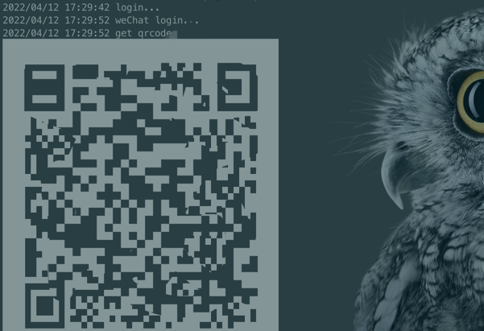
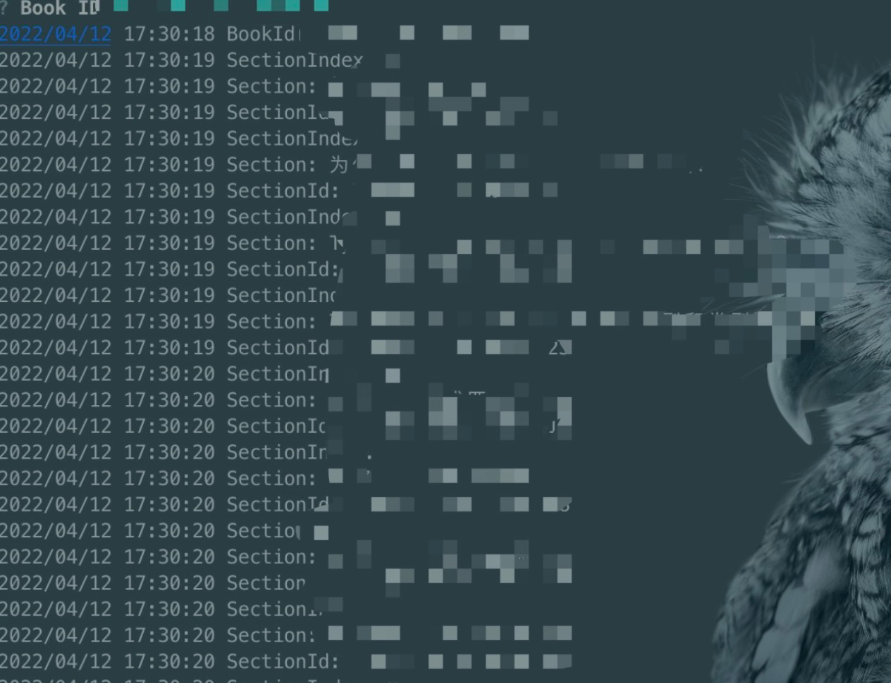

# Spider

A simple crawler tool.

It can crawl your volumes locally and save them as Markdown documents from juejin.

## Tips

For learning use only.

## Usage

```shell
$ go run .
```

or 

```shell
$ go build 
$ ./spider
```

If you're not logged in, when you run, it will prompt you to login using WeChat.


Once logged in, you will be prompted for a Book ID to crawl the contents of the booklet.


When the terminal prints done, the crawler is complete.
